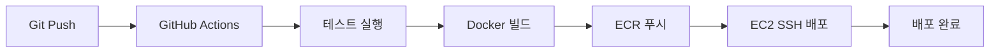

# BIF-AI Backend CI/CD 설정 가이드

## 📋 개요

BIF-AI Backend 프로젝트는 GitHub Actions와 AWS EC2를 사용한 자동화된 CI/CD 파이프라인을 구축했습니다.

### 🔄 CI/CD 파이프라인 플로우



## 🛠️ 설정 단계

### 1. EC2 인스턴스 준비

기존 EC2 인스턴스에 Docker와 AWS CLI 설치:

```bash
# Docker 설치
sudo apt-get update
sudo apt-get install -y docker.io
sudo systemctl start docker
sudo systemctl enable docker
sudo usermod -aG docker $USER

# AWS CLI 설치
curl "https://awscli.amazonaws.com/awscli-exe-linux-x86_64.zip" -o "awscliv2.zip"
unzip awscliv2.zip
sudo ./aws/install

# AWS CLI 설정
aws configure

# 방화벽 설정 (포트 8080 오픈)
sudo ufw allow 8080
```

### 2. ECR 리포지토리 설정

```bash
# 스크립트 실행 권한 부여
chmod +x scripts/setup-ec2-deployment.sh

# ECR 설정 실행
./scripts/setup-ec2-deployment.sh
```

### 3. GitHub Secrets 설정

Repository Settings → Secrets and variables → Actions에서 다음 시크릿들을 추가:

| 시크릿명 | 설명 | 예시 |
|---------|------|------|
| `AWS_ACCESS_KEY_ID` | AWS 액세스 키 | AKIA... |
| `AWS_SECRET_ACCESS_KEY` | AWS 시크릿 키 | wJalr... |
| `AWS_ACCOUNT_ID` | AWS 계정 ID | 123456789012 |
| `EC2_HOST` | EC2 Public IP | 3.36.123.456 |
| `EC2_USER` | EC2 사용자명 | ubuntu |
| `EC2_PRIVATE_KEY` | SSH Private Key | -----BEGIN RSA... |
| `DB_USER` | DB 사용자명 | bifai_user |
| `DB_PASSWORD` | DB 비밀번호 | your-password |
| `JWT_SECRET` | JWT 시크릿 | your-jwt-secret |
| `OPENAI_API_KEY` | OpenAI API 키 | sk-... |

### 3. AWS Secrets Manager 설정

다음 시크릿들을 AWS Secrets Manager에 생성:

```bash
# 데이터베이스 사용자명
aws secretsmanager create-secret \
  --name "bifai/db/username" \
  --secret-string "bifai_user" \
  --region ap-northeast-2

# 데이터베이스 비밀번호
aws secretsmanager create-secret \
  --name "bifai/db/password" \
  --secret-string "your-secure-db-password" \
  --region ap-northeast-2

# JWT 시크릿
aws secretsmanager create-secret \
  --name "bifai/jwt/secret" \
  --secret-string "your-super-secure-jwt-secret-key-minimum-64-characters-long" \
  --region ap-northeast-2

# OpenAI API 키
aws secretsmanager create-secret \
  --name "bifai/openai/api-key" \
  --secret-string "sk-your-openai-api-key" \
  --region ap-northeast-2

# Google Cloud 프로젝트 ID
aws secretsmanager create-secret \
  --name "bifai/google/project-id" \
  --secret-string "your-google-cloud-project-id" \
  --region ap-northeast-2
```

### 4. Task Definition 업데이트

`aws/task-definition.json` 파일의 `ACCOUNT_ID` 플레이스홀더를 실제 AWS 계정 ID로 변경:

```json
{
  "executionRoleArn": "arn:aws:iam::YOUR_ACCOUNT_ID:role/ecsTaskExecutionRole",
  "taskRoleArn": "arn:aws:iam::YOUR_ACCOUNT_ID:role/ecsTaskRole",
  "containerDefinitions": [
    {
      "image": "YOUR_ACCOUNT_ID.dkr.ecr.ap-northeast-2.amazonaws.com/bifai-backend:latest"
    }
  ]
}
```

## 🚀 배포 프로세스

### 자동 배포 (권장)

1. **코드 변경 후 main 브랜치에 푸시**
```bash
git add .
git commit -m "feat: 새로운 기능 추가"
git push origin main
```

2. **GitHub Actions가 자동 실행:**
   - ✅ 테스트 실행 (MySQL, Redis 포함)
   - ✅ 코드 품질 검사
   - ✅ Docker 이미지 빌드
   - ✅ ECR에 이미지 푸시
   - ✅ ECS에 자동 배포
   - ✅ 보안 취약점 스캔

### 수동 배포

```bash
# 1. 도커 이미지 빌드
docker build -t bifai-backend .

# 2. ECR 로그인
aws ecr get-login-password --region ap-northeast-2 | \
  docker login --username AWS --password-stdin YOUR_ACCOUNT_ID.dkr.ecr.ap-northeast-2.amazonaws.com

# 3. 이미지 태그 및 푸시
docker tag bifai-backend:latest YOUR_ACCOUNT_ID.dkr.ecr.ap-northeast-2.amazonaws.com/bifai-backend:latest
docker push YOUR_ACCOUNT_ID.dkr.ecr.ap-northeast-2.amazonaws.com/bifai-backend:latest

# 4. ECS 서비스 업데이트
aws ecs update-service \
  --cluster bifai-cluster \
  --service bifai-backend-service \
  --force-new-deployment \
  --region ap-northeast-2
```

## 📊 모니터링 및 로그

### CloudWatch 로그 확인
```bash
# 최근 로그 확인
aws logs tail /ecs/bifai-backend --follow --region ap-northeast-2

# 특정 시간대 로그 확인
aws logs filter-log-events \
  --log-group-name /ecs/bifai-backend \
  --start-time $(date -d "1 hour ago" +%s)000 \
  --region ap-northeast-2
```

### ECS 서비스 상태 확인
```bash
# 서비스 상태 확인
aws ecs describe-services \
  --cluster bifai-cluster \
  --services bifai-backend-service \
  --region ap-northeast-2

# 태스크 상태 확인
aws ecs list-tasks \
  --cluster bifai-cluster \
  --service-name bifai-backend-service \
  --region ap-northeast-2
```

## 🔧 트러블슈팅

### 일반적인 문제들

#### 1. 태스크가 시작되지 않을 때
```bash
# 태스크 이벤트 확인
aws ecs describe-services \
  --cluster bifai-cluster \
  --services bifai-backend-service \
  --query 'services[0].events' \
  --region ap-northeast-2
```

#### 2. 헬스 체크 실패
- `/api/health` 엔드포인트가 응답하는지 확인
- 데이터베이스 연결 상태 점검
- 환경 변수 설정 확인

#### 3. 메모리 부족 오류
- Task Definition에서 메모리 할당량 증가
- JVM 메모리 설정 조정

### 로그 레벨별 확인
```bash
# ERROR 레벨 로그만 확인
aws logs filter-log-events \
  --log-group-name /ecs/bifai-backend \
  --filter-pattern "[timestamp, request_id, ERROR]" \
  --region ap-northeast-2
```

## 🔒 보안 고려사항

### 1. 시크릿 관리
- ✅ AWS Secrets Manager 사용
- ✅ 환경변수에 민감정보 노출 금지
- ✅ 정기적인 시크릿 로테이션

### 2. 네트워크 보안
- ✅ VPC 내 프라이빗 서브넷 사용
- ✅ 보안 그룹으로 포트 제한
- ✅ ALB를 통한 HTTPS 종료

### 3. 이미지 보안
- ✅ ECR 이미지 스캔 활성화
- ✅ Trivy를 통한 취약점 스캔
- ✅ 최신 베이스 이미지 사용

## 📈 성능 최적화

### 1. 리소스 최적화
- CPU: 1 vCPU (1024 units)
- Memory: 2GB (2048 MB)
- 필요시 Auto Scaling 설정

### 2. 이미지 최적화
- Multi-stage build 사용
- .dockerignore로 불필요한 파일 제외
- Layer caching 활용

### 3. 데이터베이스 최적화
- RDS 연결 풀 설정
- 읽기 전용 복제본 사용 고려

## 📞 지원

문제가 발생하면:
1. CloudWatch 로그 확인
2. GitHub Actions 로그 확인
3. AWS ECS 콘솔에서 서비스 상태 점검
4. 필요시 수동 배포로 롤백

---

**🎯 완료 체크리스트:**
- [ ] AWS CLI 설정 완료
- [ ] GitHub Secrets 설정 완료
- [ ] AWS Secrets Manager 시크릿 생성
- [ ] Task Definition 계정 ID 업데이트
- [ ] 첫 번째 배포 성공 확인
- [ ] 모니터링 설정 완료