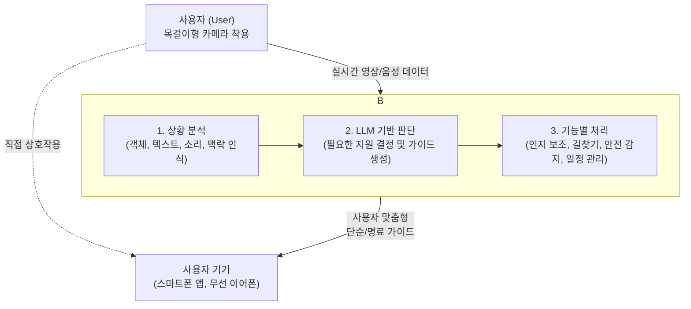

# BIF-AI 프로젝트 소개서

## 따뜻한 기술로 일상의 장벽을 허물다

경계선 지능(BIF, IQ 70-85)을 가진 이들은 지적장애에 해당하지 않음에도 불구하고, 보이지 않는 인지적 장벽으로 인해 일상생활에서 수많은 어려움에 직면합니다. 익숙한 길을 잃거나, 복잡한 상황 앞에서 판단을 망설이고, 사회적 상호작용에서 소외감을 느끼기도 합니다.

BIF-AI 프로젝트는 바로 이 지점에서 시작되었습니다. 저희는 최신 AI 기술이 단순한 편의를 넘어, 한 사람의 자립적인 삶을 지지하는 따뜻한 동반자가 될 수 있다고 믿습니다. 실시간으로 사용자의 상황을 이해하고, 가장 필요할 때 인지적 지원을 제공하는 AI 비서 시스템을 통해, 사용자가 세상과 더 자신감 있게 소통하고 안전하게 독립적인 삶을 영위하도록 돕는 것이 저희의 궁극적인 목표입니다.

---

## 당신의 눈과 머리가 되어주는 AI 비서

본 프로젝트는 목에 거는 형태의 웨어러블 카메라와 강력한 거대 언어 모델(LLM)을 결합하여, 사용자의 일상에 깊숙이 통합되는 지능형 인지 보조 시스템을 구축합니다. 시스템의 핵심 기능은 다음과 같습니다.

### ✔️ 실시간 상황 분석 및 인지 지원
카메라는 사용자의 시선을 따라 주변 환경을 끊임없이 학습합니다. 요리하는 과정, 마트에서의 물건 찾기, 혹은 타인과의 대화 같은 복잡한 상황을 AI가 실시간으로 분석하여, "다음 단계는 양파를 볶을 차례예요"와 같이 명료하고 실행 가능한 음성/텍스트 가이드를 제공함으로써 과업 수행을 돕고 사회적 상호작용을 지원합니다.

### ✔️ 안전하고 편안한 길찾기 도우미
단순히 최단 거리를 안내하는 것을 넘어, 사용자의 인지적 부담을 최소화하는 경로를 설계합니다. 복잡한 환승이나 인파가 많은 곳을 피하고, 명확한 시각적 표지판을 기준으로 단계별 안내를 제공하여 실내외 어디서든 안전하게 목적지에 도달할 수 있도록 돕습니다.

### ✔️ 24시간 사용자를 지키는 생활 안전망
내장된 GPS는 사용자의 위치를 가족이나 보호자와 공유하여 실종 위험을 방지하고, 가속도 센서와 카메라 영상 분석을 통해 낙상과 같은 위급 상황을 자동으로 감지합니다. 위험 발생 시, 시스템은 사전에 등록된 연락처나 긴급 구조 서비스에 즉시 알림을 전송하여 신속한 대응을 가능하게 합니다.

### ✔️ 스스로 학습하는 개인 비서
사용자의 반복되는 일상과 활동 패턴을 조용히 학습하여, 별도의 입력 없이도 "오후 3시, 약을 챙겨드세요" 또는 "내일 아침 병원 방문을 잊지 마세요"와 같은 개인화된 알림을 제공하며 일정을 관리해 줍니다.

---

## 시스템 작동 원리

1.  사용자가 착용한 목걸이형 카메라가 실시간 영상과 음성 데이터를 AI 서버로 안전하게 전송합니다.
2.  서버의 AI는 수신된 데이터를 분석하여 객체, 텍스트, 주변 소리 등 구체적인 정보와 함께 현재 상황의 전체적인 맥락(예: '요리 중', '대중교통 이용 중')을 파악합니다.
3.  거대 언어 모델(LLM)이 이 맥락을 해석하여 사용자가 어떤 종류의 도움을 필요로 하는지 판단하고, 가장 적절하고 이해하기 쉬운 형태의 가이드를 생성합니다.
4.  생성된 가이드는 사용자의 스마트폰 앱이나 무선 이어폰으로 즉시 전달되어, 필요할 때 정확한 도움을 제공합니다. 모든 과정은 사용자의 프라이버시를 최우선으로 고려하여 설계됩니다. 